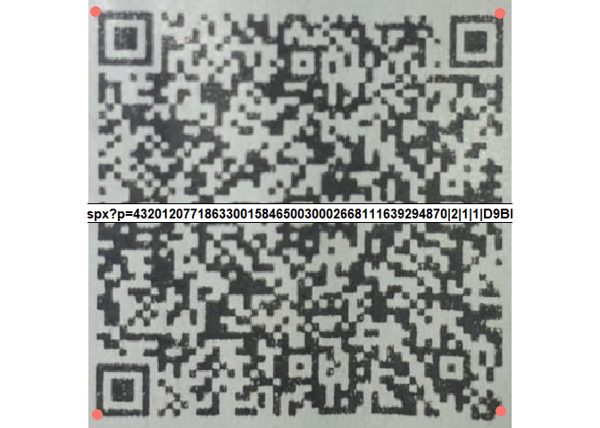

<!-- README.md is generated from README.Rmd. Please edit that file -->

# 🛍 shopper <a href='https:/shopper.github.io'></a>

<!-- badges: start -->

[](https://www.tidyverse.org/lifecycle/#experimental)

<!-- badges: end -->

Package to collect tax receipt data from SEFAZ-RS.


For now the package only collects data from the link generated by the QR
in the tax receipts.

## Installation

You can install the development version from
[GitHub](https://github.com/) with:

``` r
# install.packages("remotes")
remotes::install_github("fcsest/shopper")
```

## Example

This package helps in collecting data from SEFAZ-RS receipts, below is
an example of a complete receipt:


To collect the data we need to cropping the QR Code like this:


And setting the image cropped as parameter to
`shopper::get_qrcode_text()`…

``` r
library(shopper)
library(magrittr)

image_example <- "https://github.com/fcsest/shopper/raw/master/inst/app/www/example.png"

# Read QR Code of impressed receipt 
my_df <- get_qrcode_text(image_example) %>% 
  get_sefaz_rs_rdata()
```



``` r
str(my_df)
#> 'data.frame':    29 obs. of  7 variables:
#>  $ Código              : chr  "8389" "23641" "36535" "64880" ...
#>  $ Produto             : chr  "CEBOLA NACIONAL kg" "BATATA DOCE ROSA kg" "ABOBORA ITALIA kg" "TOMATE LONGA VIDA kg" ...
#>  $ Quantidade          : chr  "0524" "047" "0431" "0506" ...
#>  $ Medida              : chr  "kg" "kg" "kg" "kg" ...
#>  $ Valor Unidade       : chr  "3,59" "3,79" "3,39" "3,98" ...
#>  $ Valor Total         : chr  "1,88" "1,78" "1,46" "2,01" ...
#>  $ Produto_simplificado: chr  "cebola nacional" "batata doce rosa" "abobora italia" "tomate longa vida" ...
```
